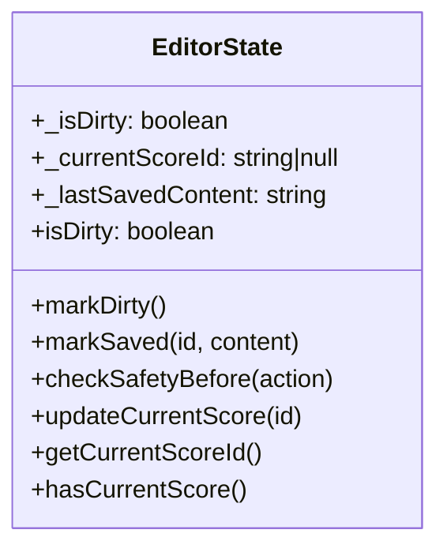
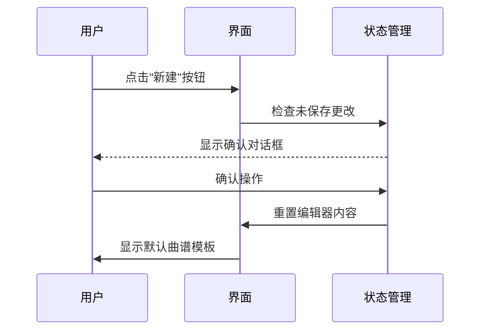

# 曲谱编辑器交互设计文档

## 状态管理类图


## 核心交互流程

### 新建曲谱流程


### 保存曲谱流程
```mermaid
flowchart TD
    A[用户点击保存] --> B{有当前曲谱ID?}
    B -->|是| C[调用scoreManager.updateScore]
    B -->|否| D[提示使用"另存为"]
    C --> E[更新状态为已保存]
    E --> F[显示成功提示]
    
    G[用户点击另存为] --> H[输入曲谱标题]
    H --> I[调用scoreManager.saveScore]
    I --> J[更新状态为已保存]
    J --> K[显示成功提示]
```

## 关键功能说明

### 编辑器区域
- 实时内容变化检测与防抖处理(300ms)
- 自动错误检测与高亮显示
- 支持从示例文件或默认模板初始化

### 预览面板
- 使用AlphaTab API进行实时渲染
- 支持多种布局模式和缩放比例
- 提供加载状态指示器

### 播放控制
- 播放/暂停/停止功能
- 速度控制(0.25x-2x)
- 节拍器开关
- 循环播放控制
- 自动适应窗口大小的缩放功能
