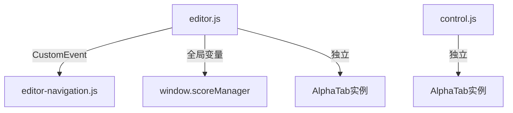

# AlphaTab编辑器重构计划

## 1. 当前架构问题分析



### 主要问题点
- 两个AlphaTab实例导致资源浪费
- 播放控制功能重复实现
- 模块间通信方式混乱(全局变量+CustomEvent)
- 职责边界不清晰(editor.js同时处理编辑和播放)

## 2. 重组方案

### 目录结构调整方案
```
src/
  script/
    core/           # 核心模块
      alpha-tab-manager.js  # AlphaTab单例管理
      event-bus.js   # 事件总线
    features/       # 功能模块
      editor/       # 编辑器相关
      player/       # 播放器相关
      navigation/   # 导航相关
```

### 模块整合方案
1. **AlphaTab单例管理**
   - 合并两个AlphaTab实例
   - 统一配置和生命周期管理

2. **功能模块划分**
   - EditorCore: 编辑器核心功能
   - PlayerControl: 播放控制
   - ScoreManager: 曲谱管理(原editor-navigation)

3. **通信机制改进**
   - 使用事件总线替代CustomEvent和全局变量
   - 定义清晰的事件类型和数据结构

### 通信接口规范
```javascript
// 事件类型示例
const Events = {
  SCORE_LOADED: 'score:loaded',
  PLAYBACK_STATE_CHANGED: 'playback:state-changed',
  EDITOR_STATE_CHANGED: 'editor:state-changed'
};

// 事件数据结构规范
{
  type: Events.SCORE_LOADED,
  payload: {
    scoreId: '123',
    content: '...'
  }
}
```

## 3. 实施步骤

1. **创建核心模块**
   - AlphaTab单例管理
   - 事件总线实现

2. **重构功能模块**
   - 分离编辑器与播放器功能
   - 重构曲谱管理模块

3. **逐步替换通信机制**
   - 从CustomEvent迁移到事件总线
   - 移除全局变量依赖

4. **测试验证**
   - 单元测试各模块
   - 集成测试完整流程

## 4. 预期收益
- 消除重复代码和资源浪费
- 提高模块内聚性
- 降低耦合度
- 增强可维护性