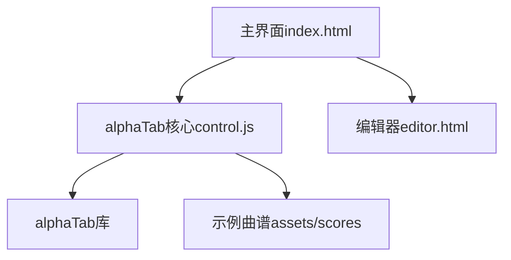

# AlphaTab浏览器高级示例(ESM)项目介绍

## 项目概述
这是一个基于alphaTab库的浏览器端吉他谱查看器和编辑器，使用ESM模块方式集成alphaTab功能。项目展示了alphaTab的高级功能实现，包括曲谱渲染、播放控制、音轨管理等。

## 主要功能

### 曲谱查看与播放
- 支持GP格式曲谱文件
- 多种布局模式(水平/垂直/分页)
- 播放控制(播放/暂停/停止/速度调节)
- 节拍器和倒计时功能

### 音轨管理
- 音轨静音/独奏控制
- 音量调节
- 音轨选择渲染

### 曲谱操作
- 拖放加载曲谱文件
- 打印功能
- GP格式导出下载

### 编辑器功能
- 基础编辑器界面(待完善)
- 曲谱列表管理

## 技术架构

## 文件结构
- `index.html`: 主界面，集成曲谱查看和播放功能
- `editor.html`: 编辑器界面
- `control.js`: alphaTab核心控制逻辑
- `editor.html`: 编辑器界面(待完善)
- `control.js`: alphaTab核心集成和功能实现
- `navigation.js`: 页面导航逻辑
- `assets/scores/`: 示例曲谱文件目录

## 运行方式
1. 通过HTTP服务器运行(如VS Code Live Server)
2. 主界面加载后可从侧边栏选择示例曲谱
3. 支持拖放本地GP文件加载

## 后续改进建议
1. 完善编辑器功能，实现曲谱编辑
2. 增加更多曲谱格式支持
3. 优化移动端适配
4. 添加用户账户和曲谱收藏功能